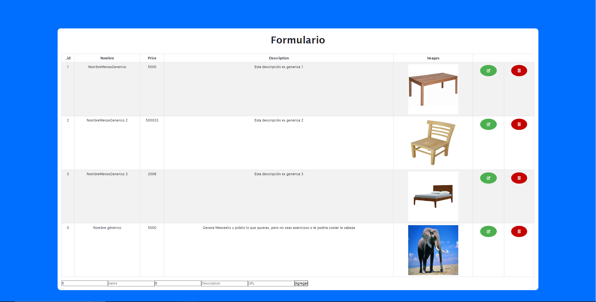
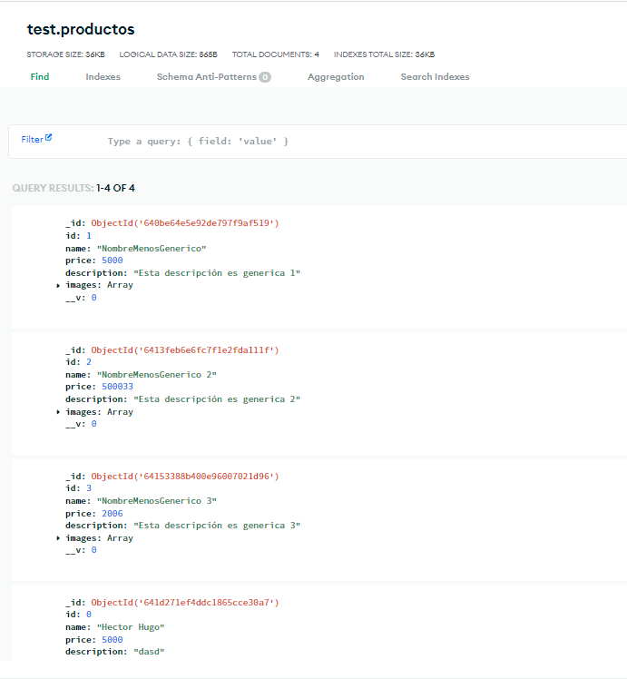

# Pasos para ejecutar el proyecto

## Abrir una terminal nueva e ingrese a la carpeta <strong> backend </strong>

### `cd backend`

## Descargue las pedendencias que necesita el proyecto

### `npm install`

## Ejecute el servido

### `npm start`

Debe mantener el servidor encendido mientras la aplicación este en uso.

## Abrir una terminal nueva e ingrese a la carpeta <strong> FrontMongo </strong>

### `cd FrontMongo`

## Descargue las pedendencias que necesita el proyecto

### `npm install`

## Ejecute el frontend

### `npm start`

# Resultado

# PANTALLA CRUD
<picture>
  
</picture>

# BASE DE DATOS
<picture>
  
</picture>
